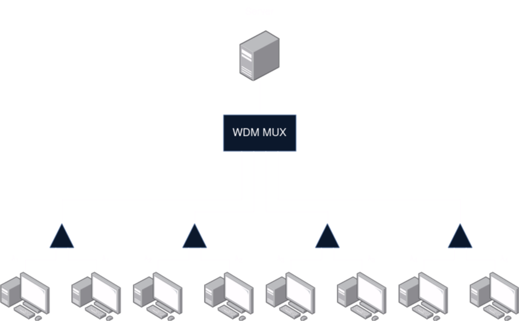
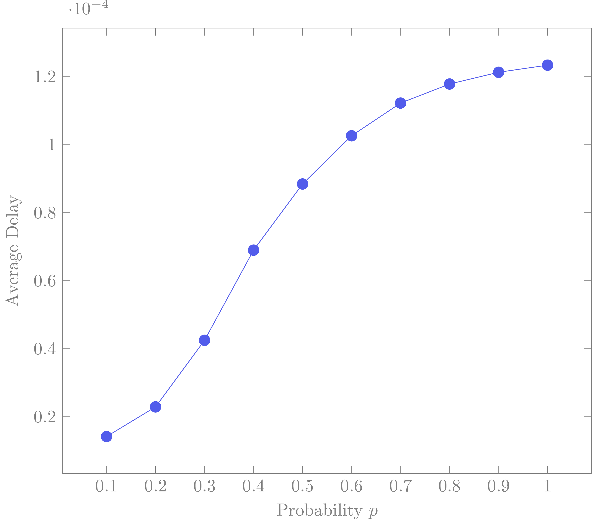
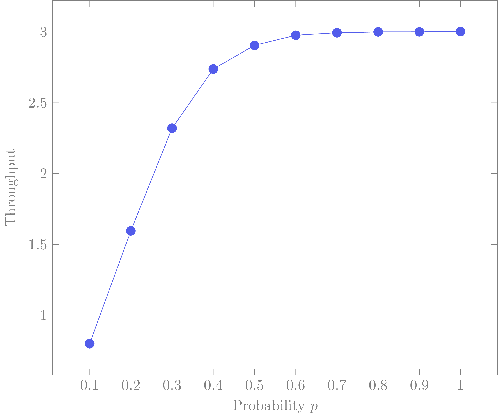
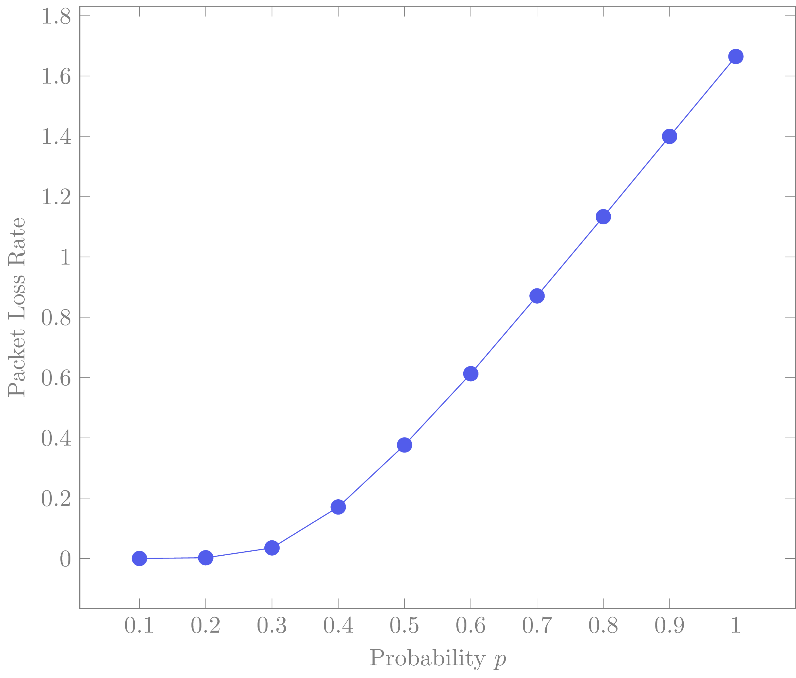

# Optical Networks Project

## Project Description
In an optical network, eight computers use four different wavelengths (λ1 – λ4) to transmit packets to a server. Computers C1 and C2 transmit using wavelength λ1, computers C3 and C4 use λ2, and so on. The connection between the server and computers is established through combiners and a Wavelength Division Multiplexer (WDM multiplexer), as illustrated in the diagram.

<p align="center">

</p>

### Transmission occurs as follows:
- Time is divided into slots, each with a duration equal to the packet transmission time.
- Each computer has a queue with a capacity of 5 packets, and the probability of an arrival during a slot is denoted by ***p***.
- If a packet arrives and finds the queue full, it is lost.
- In each slot, every computer with a non-empty queue transmits its first (oldest) packet to the server with a probability of ***0.5***. 
- If two stations sharing the same wavelength transmit in the same slot, both packets are destroyed and remain in the station queues for retransmission.

### Objectives
1. For ***p = 0.1, 0.2, ..., 0.9, 1***:
    - Calculate the average packet delay (in slots) in the network.
    - Construct a graph with the horizontal axis representing the probability ***p*** and the vertical axis representing the average packet delay.
2. For ***p = 0.1, 0.2, ..., 0.9, 1***:
    - Calculate the throughput (average number of successful transmissions in a slot) in the network.
    - Construct a graph with the horizontal axis representing the probability ***p*** and the vertical axis representing the throughput.
3. For ***p = 0.1, 0.2, ..., 0.9, 1***:
    - Calculate the packet loss rate in the network.
    - Construct a graph with the horizontal axis representing the probability ***p*** and the vertical axis representing the packet loss rate

## Calculations & Graphs
- **Propability - Average Delay Graph**
```math
Average Delay = \frac{Total Delay}{Total Packets Sent}
```

<p align="center">

</p>

- **Propability - Throughput Graph**
```math
Throughput = \frac{Total Packets Sent}{No. Slots}
```

<p align="center">

</p>

- **Propability - Packet Loss Rate Graph**
```math
Packet Loss Rate = \frac{Total Packets Lost}{Total Packets Created}
```

<p align="center">

</p>

## Usage
1. Clone the GitHub repository:
```
git clone https://github.com/stavrmaria/optical-networks-project.git
```
2. Navigate to the project directory:
```
cd optical-networks-project
```
3. Open a terminal and run `make` to build the project:

```
make
```
4. Execute the binary file:
```
./optnet
```
